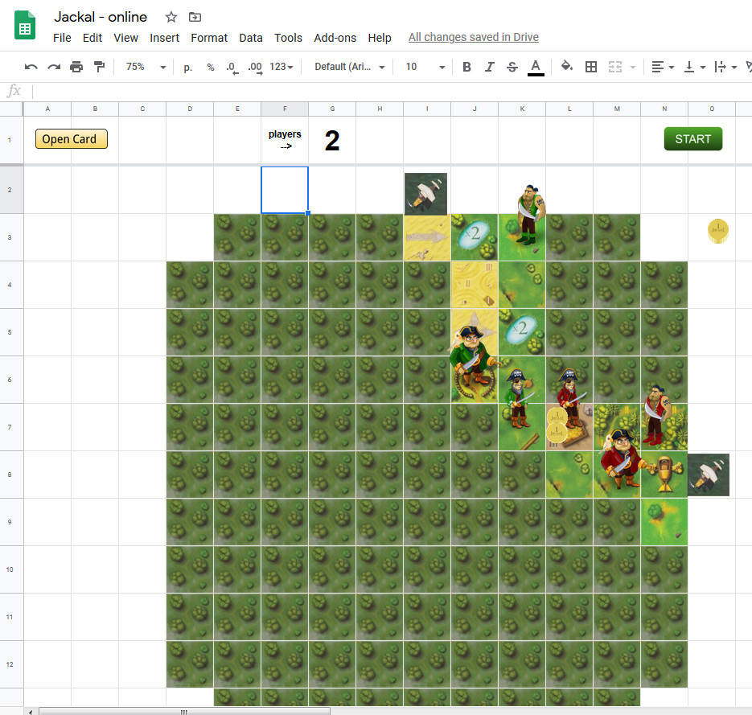

# Jackal online
Board game Jackal online on google sheet.

Make copy of this sheet - https://docs.google.com/spreadsheets/d/17Blne0YZLAuWCgxJ01glq1nGWoXTdBwy0F-2nasw-tw/

Open script editor end paste url of your new sheet whith game in the first const SPREADSHEET_URL.

# How to play
1. Set number of players and click START button. Give permissions if necessary.
2. Chose your color.
3. Move soldiers like image. If you want open card - choose them, and click "Open card" button

Screen of game:

